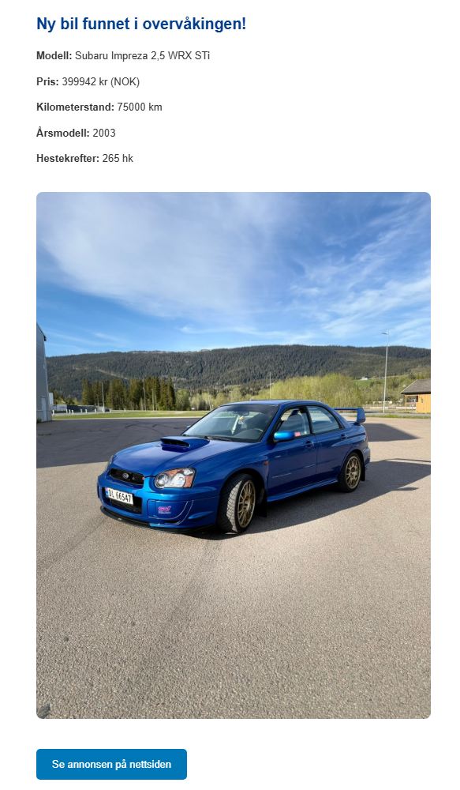

# WRX Tracker 🚗
One sentence: what it does and why you built it.

"Automated ETL pipeline that monitors Subaru WRX/STI listings across finn.no and auto24.ee, tracks price changes, and sends email alerts when new cars appear or prices drop."

## How it works
A short paragraph or simple diagram of the pipeline:

Extract (Playwright scraper) → Transform (BeautifulSoup parser) → Load (PostgreSQL) → Email alert (Gmail SMTP)

## Email Alert Preview

## Tech stack
List the technologies — this is what recruiters skim for:

Python, PostgreSQL, Docker
Playwright, BeautifulSoup, psycopg2
SMTP email notifications

## Setup
How to actually run it — copy .env.example to .env, fill in credentials, docker-compose up, python main.py.
## What I learned
2-3 sentences. This is the most underrated section for a CV project. Something like: handling rate limiting, designing an idempotent ETL pipeline, working with Docker and environment-based config.
